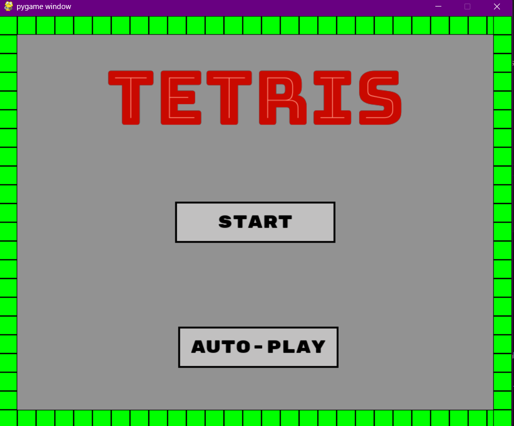

# 🟦🟨🟥 Tetris_AI 🟥🟨🟦

## 💻 The repository
This repository is where we (the Naige's Bots Team) develop a Tetris game using Python Pygame. Not only do we work on code and issues here, we also create a Machine Learning model that learns how to play tetris by watching a user do so.

## 🎲 How does the game works?
This is like the classic Tetris game: four block pices will be falling one by one in the board and they should be placed in order to complete a board row. The game ends when there´s no space left in the board to put new places. You can access this game mode by clicking in the "Start" button in the main page.

## 🔮 How does the AI works?
The AI is designed to learn from a large database of around 20k records from organic plays to analyze game strategies and learn to play from them, making the best game decisions based on the given board and pieces. You can access this game mode by clicking in the "Auto-Play" button in the main page.

## 🚀 Installation
First, clone the repository. Then, go into your favorite terminal.
    git clone git@github.com:YOUR_USERNAME/Test-Tetris.git
    npm install
Now, open the folder in your IDE and inside the main folder, open the "main.py" file and run it. The main page will display in your screen. Now, choose the play mode you want!

## 📸 Screenshots
While playing, your screen will look like this:
(images/game_window.jpg)
You can find the main board in the center of the window. At the same time, in the left side you can find the "Hold" container (holding a pice if you select the 'c' keyword while playing) and the score of the game. In the other side you can find de "Next pices" container, that will display the next three pices of the game.

When the game ends, you will see a page like the following:
(images/game_ended_window.jpg)
In this one, you can find a button to return to the main page of the game.

## 👥 Collaborators
- [@Artu-GR](https://github.com/Artu-GR)
- [@An-Isa93](https://github.com/An-Isa93)
- [@ValeriaNaige](https://github.com/ValeriaNaige)
- [@RebecaJara](https://github.com/RebecaJara)
- [@yayo81236](https://github.com/yayo81236)
